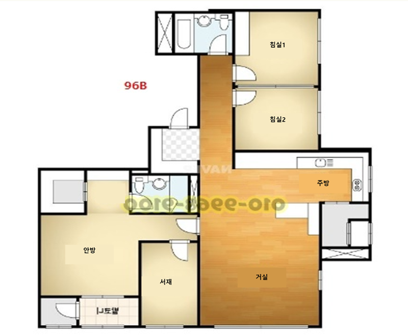

### 가설공사: 140만원

- 실리콘 마감
- 운반
- 현장정리인
- 폐기물처리 2회
- 승강기보양

### 철거공사: 223만원

- 냉장고장
- 공용욕실
  - 세면대
  - 양변기
  - 욕조
  - 샤워기 수전
- 안방욕실
  - 세면대
  - 양변기
  - 수납장
- 마루
- 천장 몰딩
- 걸레받이
- 조명
- 안방 화장대
- 도시가스배관
- 다용도실 선반

### 가구공사: 562만원

- 싱크대볼 교체
- 서재 시스템장+붙박이장
- 냉장고장+키큰장
- 화장대+거울
- 식기세척기 자리 + 작은 서랍장장
- 아일랜드 밥솥덮개
- 싱크대 하부장 레일형으로

### 바닥공사: 438.6만원

- 강마루: 마뷸러스 뮤즈 / 모네 로키 / KCC 스프링화이트, 어텀그레이 / LX 에디톤플로어
- 걸레받이: 4cm

### 목공사: 117만원

- 거실몰딩
- 우물천장 간접

### 전기/조명공사: 256.6만원

- 전체 조명교체
- 인덕션
- 우물간접
- 커튼박스간접
- 아카라 스위치(?) / 허브
- 커튼박스 콘센트

### 필름공사: 297만원

- 문+문틀 7개
- 창틀 6개

### 도배: 270만원

- 실크벽지: LX 디아망(공용부), 개나리 로하스(방)
- 에어콘 배관 없애기
- 드레스룸 포함(?)

### 공용욕실: 210만원

- 양변기
- 세면기
- 수전
- 샤워수전
- 욕조
- 줄눈

### 안방욕실: 170만원원

- 양변기
- 세면기
- 수전
- 거울장
- 줄눈

